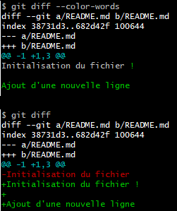

# Comparer des changements

[Sommaire](./00-Sommaire.md)

    On compare des modifications grâce à la commande git diff.

    L'option --color-words permet de visualiser le détail de changements par mots plutôt que par ligne.

    Par défaut, les données comparées sont les données modifiées depuis le dernier commit.

    Si des modifications ont déjà été ajoutées à la zone de staging, elles ne seront pas visibles par défaut, il faudra utiliser l'option --cached.

## Comparer les changements

Il est possible d'effectuer cette comparaison grâce à la commande git diff. Cette commande permet d'effectuer des comparaisons entre plusieurs sources de données Git. Par défaut, cette commande permet de comparer l'état des fichiers depuis le dernier commit.

Néanmoins, il est possible de comparer d'autres éléments entre eux, tels que des commits ou des branches.

Supposons que nous disposions d'un fichier README dont le contenu initial lors du dernier commit était le suivant :

```markdown
Initialisation du fichier README

Une information
```

Nous l'avons ensuite modifié de telle sorte, en y ajoutant une nouvelle ligne :

```markdown
Initialisation du fichier README

Une information modifiée

Une nouvelle information
```

Si l'on exécute la commande git diff, voici ce qu'il en ressortira :

```markdown
git diff
# Cette ligne indique les fichiers ayant été comparés
diff --git a/README.txt b/README.txt
# Ici, il s'agit des métadonnées internes de Git, représentant les identifiants des objets.
index 7778e04..9bee702 100644
# Les --- représentent les informations retirées, +++ les informations ajoutées.
--- a/README.txt
+++ b/README.txt
# Ici, on constate qu'une ligne a été retirée à la ligne 3 (il s'agit de la ligne modifiée), tandis qu'une nouvelle ligne a été ajoutée à la ligne 5.
@@ -1,3 +1,5 @@
 Initialisation du fichier README

-Une information
+Une information modifiée
+
+Une nouvelle information

# Attention:
Les données ayant déjà été ajoutées à la zone de staging grâce à git add ne seront par défaut pas présentes dans le diff, veillez donc à utiliser cette commande avant d'effectuer un git add.

Si vous souhaitez tout de même visualiser ces modifications, il conviendra d'utiliser l'option --staged ou --cached.
```

```markdown
# Si le diff n'est pas assez précis, il est possible d'ajouter l'option --color-words.
```


