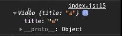

# <div style="color: #26B260">**Angular Rappel JS**</div>

[Sommaire](./00-Sommaire.md)

## <span style="color: #aaffff">**arrow function | le mot clé this | opérateur new**</span>

## déclarer une fonction.

```javascript
function maFonction() {
   // code de la fonction
}
```

## Méthode, c'est une fonction dans un objet.

Déclaration d'un objet.

```javascript
const video = {
    title: 'titre', // propriété title
    //Méthode play qui affiche this, this fait réference a mon objet (myObjet)
    play() {
        console.log(this);
    }
};
// appel de la méthode play dans l'objet video
video.play();
```

Le this fait référence a mon objet (video)


Aperçu dans la console


```javascript
const video = {
    title: 'titre', // propriété title
    //Méthode play qui affiche this, this fait réference a mon objet (myObjet)
    play() {
        console.log('1',this);
    }
};
// appel de la méthode play dans l'objet video
video.play();
// ici this fait réference à la fenêtre windows car il n'est pas dans l'objet video.
function maFonction() {
    console.log('1.1',this);
}
// atention car this ne fait pas réference au même endroit.

```

Aperçu dans la console


## Déclaration d'une fonction constructor.

On la nomme en PascalCase.

```javascript
// Constructor function
function Video(title) {
    this.title = title; // j'enregistre title dans this.title
    console.log('2',this); // pour voir a quoi fait réference this
}
// Création d' un objet video1 à partir de la fonction Video(title) et va lié le this a cet objet
const video1 = new Video('a');
```
C'est un objet crée à partir de Video.



Un constructor function, c'est une fonction qui va créer un objet.

## factory function

elle fait la même chose, c'est une usine qui crée des objet

```javascript
// factory function
function createVideo(title) {
    console.log('3',this);
    return {
        title: title,
    };
}
// Création de creatVideo mais sans le mot clé new
const video2 = cretaVideo('3');
console.log('video2', video2);
```

le this du console.log('3',this) fait référence à la fenêtre Window et non pas a l'objet


alors que j'ai bien créer un objet.


this ne fait pas référence a cet objet mais a l'objet global.

## fonction callback

```javascript
const video = {
    title: 'titre',
    tags: ['tag1', 'tag2', 'tag3'],
    showTags() {
        console.log(this);// this fait réference à l'objet video        
        this.tags.forEach(function (tag) { // function(tag) est une fonction callback.
            console.log(this.title, tag);          
        }, this);// en mettant this en deuxième argument il sera lié au this.title.
    }
}
```

## Arrow function

est le moyen le plus sur de lié le this, afin de partager le context..

Déclaration d'un arrow function.

```javascript
let arrow = (paramètre1, paramètre2) => {
    console.log(paramètre1, paramètre2);
};

// appel de la fonction
arrow('Jean', 12);
```


```javascript
const video = {
    title: 'titre',
    tags: ['tag1', 'tag2', 'tag3'],
    showTags() {
        console.log(this);// this fait réference à l'objet video        
        this.tags.forEach((tag) => { // la flèche lié le context parent à la fonction.
            console.log(this.title, tag);// ici this sera lié à la fonction parent.          
        });
    }
};
```


## Méthode bind.(lié)à 22minutes

## Méthode call