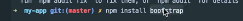
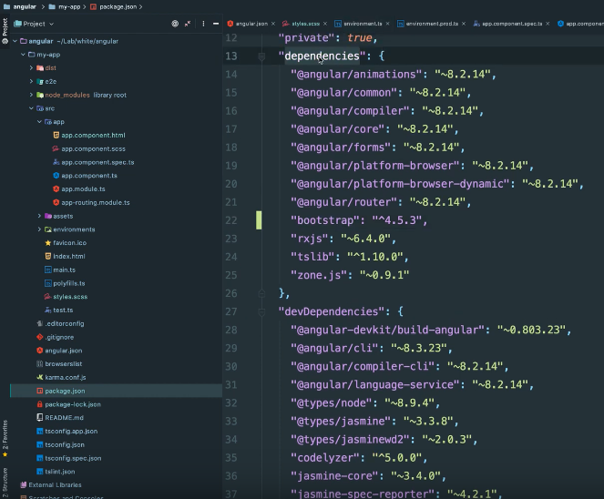

# 
**Présentation structure Angular**

[Sommaire](./00-Sommaire.md)

*e2e*, veut dire end to end, dossier qui contient des tests end to end, ce sont des tests écris coté navigateur pour tester les réactions cotée navigateur, le html.

*node_modules*, qui détient toutes les dépendances de notre projet

*angular.json*, c'est un fichier qui contient les informations sur notre projet, les tyles, les scripts, les configurations, etc.

*package.json*, on peut voir les dépendances, les types de script que l'on peut appeler(ng, start, build, test, lint, e2e)

*src* dossier source où on n'a tout notre projet, tous les fichiers sources pour notre application.
On trouve à l'intérieur : 
le dossier style.scss, contient tout les style de notre application.

*environnement*, ce dossier contient nos variables d'environnement.

*assets*, ce dossier contient les images.

*app*, ce dossier contient notre application, dont.

ils corespondent à un composant.(html pour la page, scss pour le style, spec pour les tests, ts pour typescript).
app.module.ts et app.routing.modules.ts

### **Installer bootstrap**

Tapez npm install bootstrap, dans le terminal.

Maintenant bootstrap est bien dans mes dépendances.

et aussi dans le dossier node_modules.

Ajoutez bootstrap dans le fichier angular.json, puis dans "styles"

