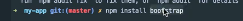
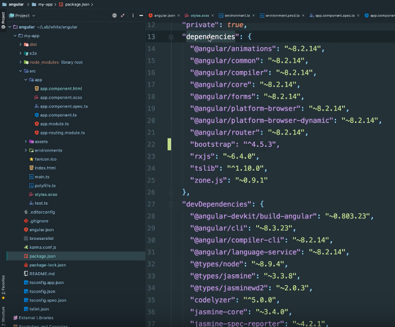
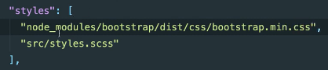

# <div style="color: #26B260">**Installation des outils**</div>

[Sommaire](./00-Sommaire.md)

## <span style="color: #26B260">*Installer NodeJS*</span>

Télécharger nodejs sur le site nodejs.org

## <span style="color: #26B260">*Installer Angular*</span>

Tapez dans le Terminal

```markdown
npm install -g @angular/cli
```

cli, pour Commande Line Interface.

## <span style="color: #26B260">*Installer bootstrap*</span>

Tapez npm install bootstrap, dans le terminal.



Maintenant bootstrap est bien dans mes dépendances.



et aussi dans le dossier node_modules.

Ajoutez bootstrap dans le fichier angular.json, puis dans "styles"

