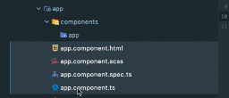
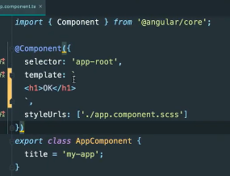

# **Notre premier composant**

[Sommaire](./00-Sommaire.md)

Dans le dossier app, crée un dossier composant puis à l'intérieur crée un dossier app, sélectionné les fichiers app.component.

puis couper/coller et les déplacer dans le nouveau dossier app.
Vérifier dans le fichier app.module.ts qu'il importe bien nos fichiers que nous avons déplacés.

Dans le fichier app.component.ts.

Un component est une classe que l'on exporte et qui est annoté d'une directive qui s'appelle @Component.Elle est importée à partir du core d'angular 

à l'intérieur du décorateur @Component, on trouve :

*selector* : il s'agit du nom qu'on utilisera comme balise HTML pour afficher ce component. Ce nom doit être unique et ne doit pas être un nom réservé HTML de type div, body, etc. On utilisera donc très souvent un préfixe comme app.
ici 'app-root'.

*templateUrl*: le chemin vers le code HTML à injecter, './app.component.html',

On peut aussi écrire du html entre des backticks.

*styleUrls* : un array contenant un ou plusieurs chemins vers les feuilles de styles qui concernent ce component, 'app.component.scss'.

## Créer un component avec**ng generate component**

Tapez dans le terminal.

ng generate component nomDuComponent

exemple: ng generate component about

Raccourci : *ng g c about*

Le CLI a créé un nouveau sous-dossier **about** et a créé quatre fichiers

*about.component.html*, pour la page html

*about.component.scss*, une feuille de styles

*about.component.ts*, un fichier component

*about.component.spec.ts*, un fichier spec pour les tests
