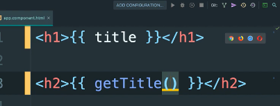

# **Interpolation**

[Sommaire](./00-Sommaire.md)

L'interpolation c'est le fait d'afficher une variable dans le html ou une méthode grâce à deux accolades **{{ title }}** entre les balises.

La variable title par interpolation.

méthode getTitle( ) par interpolation.

