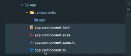
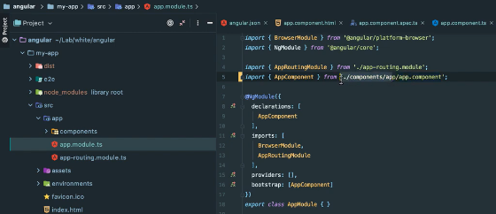
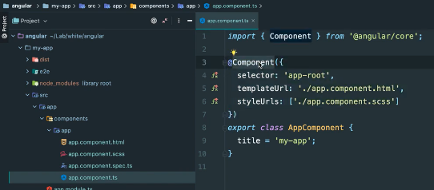
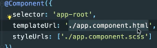
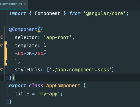
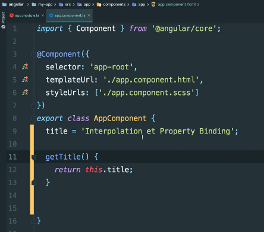
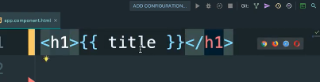
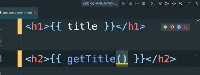

# **Notre premier composant**

[Sommaire](./00-Sommaire.md)

Dans le dossier app, créé un dossier composant puis à l'intérieur créé un dossier app, sélectionné les fichiers app.component.

puis couper/coller et les déplacer dans le nouveau dossier app.
Vérifier dans le fichier app.module.ts qu'il importe bien nos fichiers que nous avons déplacés.

Dans le fichier app.component.ts.

Un component est une classe que l'on exporte et qui est annoté d'une directive qui s'appelle @Component.Elle est importée à partir du core d'angular 

à l'intérieur du décorateur @Component, on trouve :

*selector* : il s'agit du nom qu'on utilisera comme balise HTML pour afficher ce component. Ce nom doit être unique et ne doit pas être un nom réservé HTML de type div, body, etc. On utilisera donc très souvent un préfixe comme app.
ici 'app-root'.

*templateUrl*: le chemin vers le code HTML à injecter, './app.component.html',

On peut aussi écrire du html entre des backticks.

*styleUrls* : un array contenant un ou plusieurs chemins vers les feuilles de styles qui concernent ce component, 'app.component.scss'.

## Créer un component avec **ng generate component**

Tapez dans le terminal.

ng generate component nomDuComponent

exemple: ng generate component about

Raccourci : *ng g c about*

Le CLI a créé un nouveau sous-dossier **about** et a créé quatre fichiers

*about.component.html*, pour la page html

*about.component.scss*, une feuille de styles

*about.component.ts*, un fichier component

*about.component.spec.ts*, un fichier spec pour les tests

# **Interpolation**

[Sommaire](./00-Sommaire.md)

L'interpolation c'est le fait d'afficher une variable dans le html ou une méthode grâce à deux accolades **{{ title }}** entre les balises.

La variable title par interpolation.

méthode getTitle( ) par interpolation.

# **6. Property binding**

## **7. event binding**

*couleur*

## **two way data binding**

## **ngif**

## **ngfor**

## **Découpage des composants**

## **Partages des données à un composant enfant - Input decorator**

## **Émettre des données au composant parent**

## **Modules**

### **routing**

### **routing params**

### **routing router service**

### **component licycle**

### **Programmation réactive avec la librairie RxJs**

### **Services et injection des dépendances**

### **Services et observable**

### **Reactive Forms - PARTIE 1**

### **reactive forms - partie 2**

### **Effectuer des requêtes http à notre api**

### **Envoyer des données au serveur avec la méthode post**

### **Gérer nos requêtes grâce aux services**

### **21. a faire**
