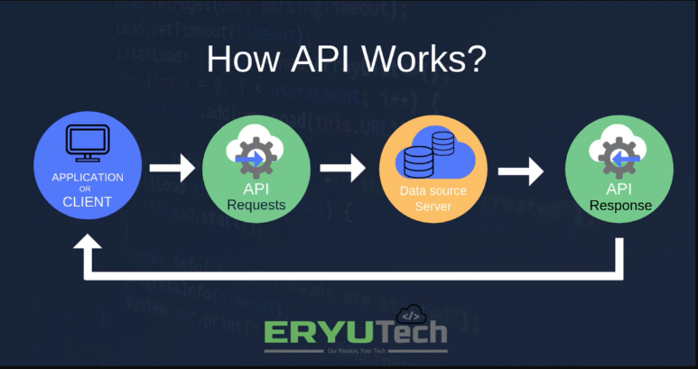

# **Présentation.**

[Sommaire](./00-Sommaire.md)

Une API, pour Application Programming Interface, permet d'utiliser les ressources, données ou fonctionnalités, d'une application web depuis une autre application.
C'est une interface qui permet à deux programmes de communiquer entre eux.

