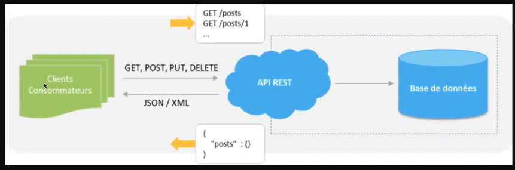
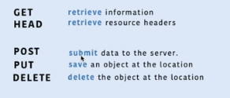
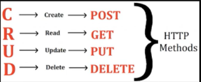
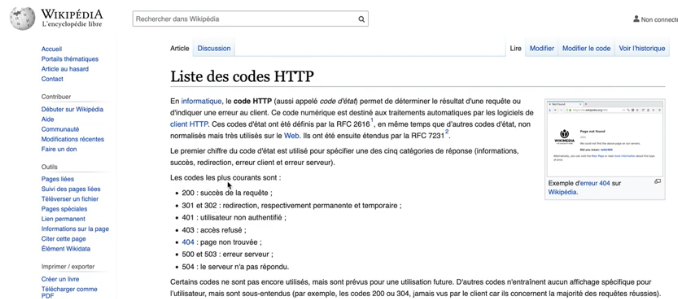
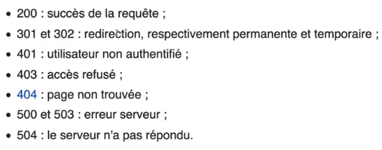
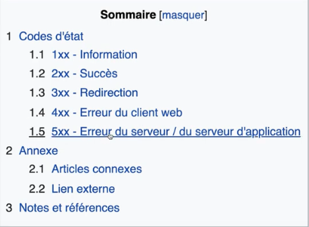

# **HTTP**

[Sommaire](./00-Sommaire.md)

HTTP, veux dire Hypertext Transfert Protocol. C'est un protocole sans état, elle ne sauvegarde pas l'état de la connection http.

Utilisé pour communiquer entre le navigateur et le serveur web.

Le navigateur va envoyer une requête http au serveur, le serveur va renvoyer une réponse.

Comment est constitué une requête http?

En premier URL où on va faire la requête(Request URL: http://)

En second (Request Method: GET), quel est le type de notre requête.

Les verbes http.

GET pour obtenir.

POST pour soumettre.

PUT pour sauvegarder.

DELETE pour supprimer.

Pour créer un utilisateur, on va utiliser la méthode POST. Ces données seront envoyées au serveur.

Pour lire les données d'un utilisateur, on va utiliser la méthode GET pour récupérer des informations de l'utilisateur.

Pour mettre à jour l'utilisateur, on utilise la méthode PUT.

Pour supprimer l'utilisateur, on utilise la méthode DELETE.

En troisième, le status code apparait une fois la réponse effectuée, 200 réponse avec succès.

Request Headers, ce sont des informations que l'on met lorsque l'on va requêter le serveur.

Response Headers, seront lorsque le serveur aura renvoyé les données, ce sont des informations du serveur.

Dans l'onglet Response de la console du navigateur, nous avons la réponse du serveur, Preview permet de voir les données.

On peux avoir le code les plus courant sur le site Wikipédia.

