# **Logiciel pour tester une api.**

[Sommaire](./00-Sommaire.md)

On test les route avec un logiciel comme par exemple insomnia ou postman.

Ils permettent de faire des requêtes.

Crée un espace de travail.

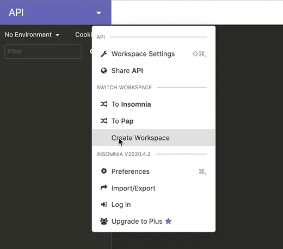

Rajouté une nouvelle requête.

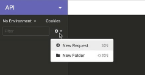

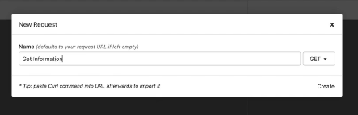

Ensuite, il faut lui mettre l'URL de l'api, puis la méthode.

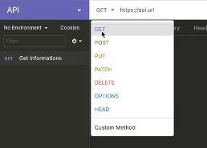

Et enfin choisir le type de format.

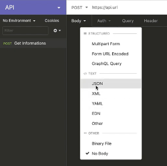

Comment faire une requête sur une api?

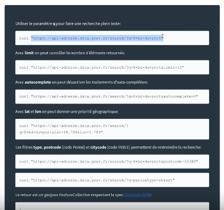

On copie l'adresse http dans le curl.

On a en premier l'origine de l'adresse (http:// api-adresse.data.gouv.fr) puis la route (/search/) et les query params qui se nomme (q) (?q=8+bld+du+port).

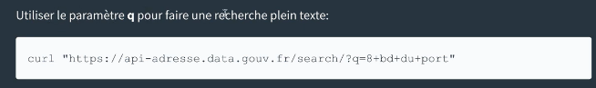

On peut lui ajouter une limit avec le query params (&limit).

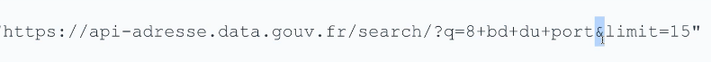

On aura seulement que 15 réponses.

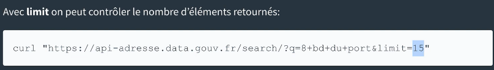

Exemple :

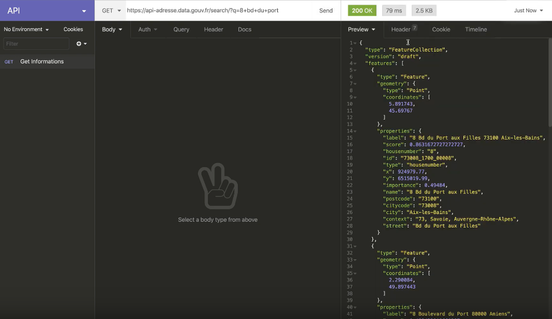

On peut aussi le faire dans l'onglet Query.

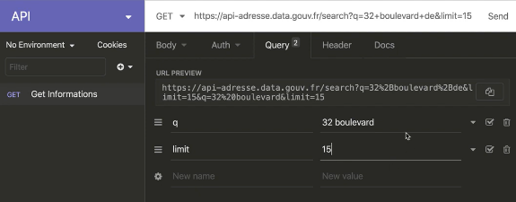

Liste des attributs.

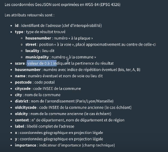

Il peut avoir des APIs public ou privée, pour les API privées il faut demander un accès à l'API.
