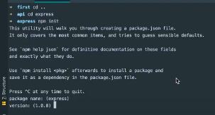

# **Présentation et installation de ExpressJs.**

[Sommaire](./00-Sommaire.md)

Cette librairie est très utilisée avec Angular, React, bon nombre de projets.

Allez sur le site expressjs.com dans mise en route.

L'onglet Guide.

Installation d'express.

Créer un dossier express, se mettre dedans puis faire l'initialisation en tapant (npm init dans le terminal)

Dans le terminal.

Tapez sur entré pour répondre aux question, puis il va initialiser un fichier (package.json).

Installer la dépendance express avec --save.

ça va rajouter un dossier node_modules et un fichier (package-lock.json).

Créer un fichier .gitignore, pour ne pas envoyer sur git le dossier node_module et idea.

