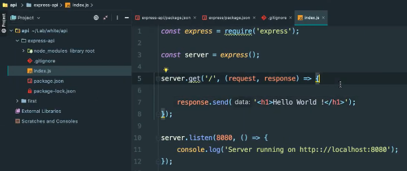

# **Créer un server http avec ExpressJs.**

[Sommaire](./00-Sommaire.md)

Crée un nouveau fichier nommé index.js, puis récupérer la librairie express avec le mot clé (require).

Créer un serveur dans le fichier index.js, on invoque express dans la const server.

Pour activé le serveur on va utiliser (.listen(le port, et une fonction callback)).

Pour executer le serveur, on va dans le terminal et on tape (node index.js)

Comment indiquer une route en GET?

Sur notre serveur on va lui indiquer la méthode (.get(URL, fonction callback avec la request, response))

On peut renvoyer un titre avec h1.

On rajoute une deuxième route ('/users').

On rajoute une route post('users').

Sur Insomnia.

