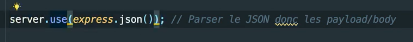

# **Paramètre de route et contenue de la requête.**

[Sommaire](./00-Sommaire.md)

Pour accéder à la propriété de request, je dois utiliser body, il faut implémenter un middleware.

Maintenant, j'ai accès au contenu de ma requête.

De cette manière, je peux récuperer le contenu d'une requête.

Grâce aussi au middleware.

Cas où, on souhaite supprimer un route (users/:id).

:id, indique un paramètre dans l'URL.

On voit que user récupère bien l'id dans l'URL.

Mettre à jour un utilisateur avec la méthode put.

On fait dans Insomnia une requête put avec l'URL et la route (/users/) puis l'id (234) et on met à jour via l'onglet JSON les données.
