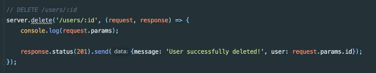
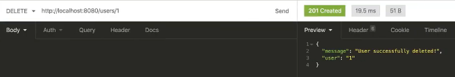
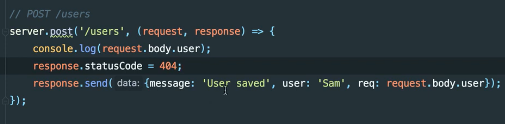
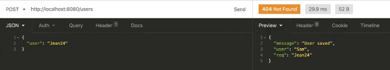
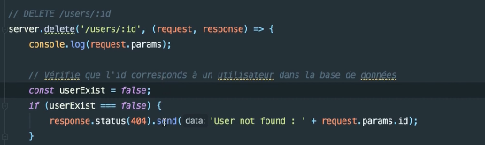
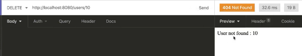

# **Gérer les erreurs et changer le status de la réponse.**

[Sommaire](./00-Sommaire.md)

Comment changer les status de la requête.

Dans Insomnia.

Une autre façon.

Dans Insomnia.

Vérifier que l'id corresponds à un utilisateur.

Dans Insomnia.

