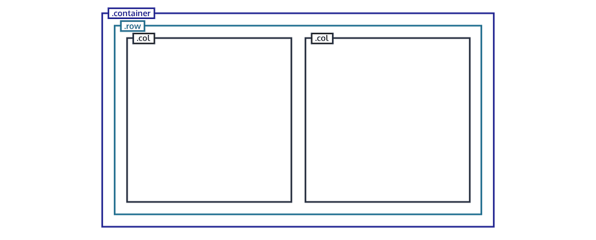

# <div style="color: #26B260">**La Class container.**</div>

[Sommaire](./00-Sommaire.md)

La classe <span style="color: yellow">*container*</span>, englobe la totalité de la grille et contient des lignes <span style="color: yellow">*row*</span>, qui contiennent des colonnes <span style="color: yellow">*col*</span>.

```html
    <div class="container">
    <div class="row"><!--Première ligne-->
        <div class="col"></div><!--Première colonne de la première ligne-->
        <div class="col"></div><!--Deuxième colonne de la première ligne-->
    </div>
```



Une ligne <span style="color: yellow">*row*</span>, contient 12 colonnes de base dans bootstrap.

<span style="color: yellow">*.container*</span> : fixe une largeur maximale (max-width) à chaque point de rupture.

<span style="color: yellow">*.container-fluid*</span> : largeur 100 % à tous les points de rupture.

<span style="color: yellow">*.container-{breakpoint}*</span> : largeur 100 % jusqu'au point de rupture spécifié ({breakpoint}, ex : .container-sm).
