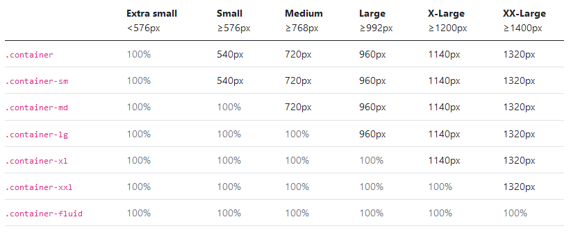

# <div style="color: #26B260">**Les breakpoints**</div>

[Sommaire](./00-Sommaire.md)

Les breakpoints servent à modifier les éléments de la grille en fonction des différentes taille d'écran.

1. xs extra small.(inférieur à 576px) (petit smartphone)
2. sm small.(entre 577px et 768px) (smartphone)
3. md medium.(entre 769px et 992px) (tablette)
4. lg large.(entre 992px et 1200px) (petit ordinateur)
5. xl extra large.(supérieur à 1200px) (ordinateur de bureau)



Exemple:

```html
    <div class="col-lg"></div>
```
