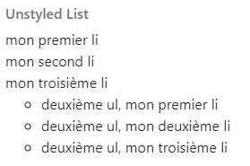
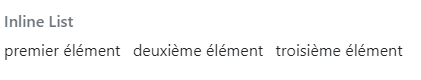
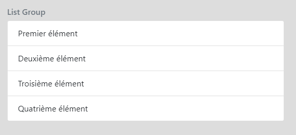
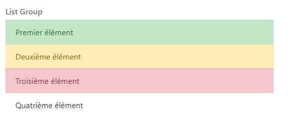

# <div style="color: #26B260">**Les listes.**</div>

[Sommaire](./00-Sommaire.md)

- Pour supprimer les styles sur les listes, il faut utiliser la classe <span style="color: yellow">*list-unstyled*</span>.

```html
    <ul class="list-unstyled">// <!--supprime les puces devant le texte.-->
        <li>mon premier li</li>
        <li>mon second li</li>
        <li>mon troisième li
            <ul><!--liste à puces de base, avec les petits rond.-->
                <li>deuxième ul, mon premier li</li>
                <li>deuxième ul, mon deuxième li</li>
                <li>deuxième ul, mon troisième li</li>
            </ul>
        </li>
    </ul>
```



- Pour créer une liste d'éléments en lignes, il faut ajouter la classe <span style="color: yellow">*list-inline*</span> à l'élément ul, et <span style="color: yellow">*list-inline-item*</span> à chaque élément li.

```html
    <ul class="list-inline"><!-- met les puces les un à la suite des autres, horizontalemment.-->
      <li class="list-inline-item">premier élément</li>
      <li class="list-inline-item">deuxième élément</li>
      <li class="list-inline-item">troisième élément</li>
    </ul>
```



- Pour créer une liste d'éléments sous forme de menu, il faut ajouter la classe <span style="color: yellow">*list-group*</span> à l'élément ul, et <span style="color: yellow">*list-group-item*</span> à chaque élément li.

```html
    <ul class="list-group">
      <li class="list-group-item">Premier élément</li>
      <li class="list-group-item">Deuxième élément</li>
      <li class="list-group-item">Troisième élément</li>
      <li class="list-group-item">Quatrième élément</li>
    </ul>   
```



```html
<!-- Ajout de couleur sur list-group-item -->
    <ul class="list-group">
      <li class="list-group-item-success">Premier élément</li>
      <li class="list-group-item-danger">Deuxième élément</li>
      <li class="list-group-item-warning">Troisième élément</li>
      <li class="list-group-item">Quatrième élément</li>
    </ul>   
```

