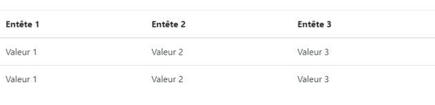
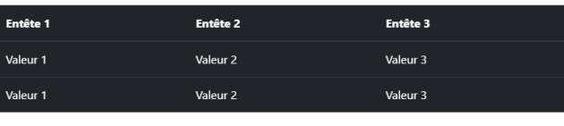
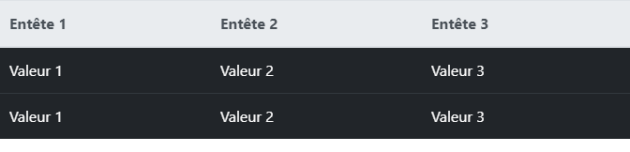
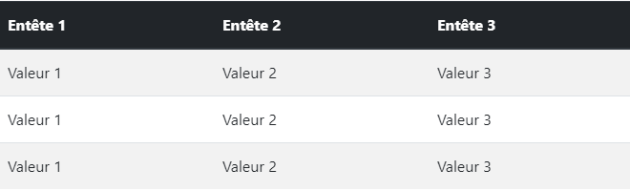

# <div style="color: #26B260">**Les tableaux.**</div>

[Sommaire](./00-Sommaire.md)

<span style="color: yellow">*.table*</span>, permet de styliser un tableau, exemple ci-dessous.


```html
    <table class="table">
        <thead>
            <tr>
                <th>Entête 1</th>
                <th>Entête 2</th>
                <th>Entête 3</th>
            </tr>
        </thead>
        <tbody>
            <tr>
                <td>Valeur 1</td>
                <td>Valeur 2</td>
                <td>Valeur 3</td>
            </tr>
            <tr>
                <td>Valeur 1</td>
                <td>Valeur 2</td>
                <td>Valeur 3</td>
            </tr>
        </tbody>
    </table>
```

<span style="color: yellow">*.table-dark*</span>, pour un tableau en fond noir dans la class de la balise (table), exemple ci-dessous.


```html
    <table class="table table-dark">
        <thead>
            <tr>
                <th>Entête 1</th>
                <th>Entête 2</th>
                <th>Entête 3</th>
            </tr>
        </thead>
        <tbody>
            <tr>
                <td>Valeur 1</td>
                <td>Valeur 2</td>
                <td>Valeur 3</td>
            </tr>
            <tr>
                <td>Valeur 1</td>
                <td>Valeur 2</td>
                <td>Valeur 3</td>
            </tr>
        </tbody>
    </table>
```

<span style="color: yellow">*.thead-light*</span>,met l'en-têtes des colonnes en clair, exemple ci-dessous.


```html
    <table class="table">
        <thead class="thead-light"><!-- Ou thead-dark, pour mettre en foncé.-->
            <tr>
                <th>Entête 1</th>
                <th>Entête 2</th>
                <th>Entête 3</th>
            </tr>
        </thead>
        <tbody>
            <tr>
                <td>Valeur 1</td>
                <td>Valeur 2</td>
                <td>Valeur 3</td>
            </tr>
            <tr>
                <td>Valeur 1</td>
                <td>Valeur 2</td>
                <td>Valeur 3</td>
            </tr>
        </tbody>
    </table>
```

<span style="color: yellow">*.thead-dark*</span>,met l'en-têtes des colonnes en foncé.

<span style="color: yellow">*.table-striped*</span>, une ligne sur deux sera coloré, exemple ci-dessous.


```html
    <table class="table table-striped">
        <thead class="thead-dark"><!-- en-tête en foncé -->
            <tr>
                <th>Entête 1</th>
                <th>Entête 2</th>
                <th>Entête 3</th>
            </tr>
        </thead>
        <tbody>
            <tr>
                <td>Valeur 1</td>
                <td>Valeur 2</td>
                <td>Valeur 3</td>
            </tr>
            <tr>
                <td>Valeur 1</td>
                <td>Valeur 2</td>
                <td>Valeur 3</td>
            </tr>
        </tbody>
    </table>
```

<span style="color: yellow">*.table-hover*</span>, colorie au survol de la souris.

```html
    <table class="table table-hover"><!-- au survole de la souris. -->
        <thead>
            <tr>
                <th>Entête 1</th>
                <th>Entête 2</th>
                <th>Entête 3</th>
            </tr>
        </thead>
        <tbody>
            <tr>
                <td>Valeur 1</td>
                <td>Valeur 2</td>
                <td>Valeur 3</td>
            </tr>
            <tr>
                <td>Valeur 1</td>
                <td>Valeur 2</td>
                <td>Valeur 3</td>
            </tr>
        </tbody>
    </table>
```

<span style="color: yellow">*.table-primary*</span>, colori le fond du tableau.

```html
    <table class="table table-primary"><!-- couleur de fond du tableau. -->
        <thead>
            <tr>
                <th>Entête 1</th>
                <th>Entête 2</th>
                <th>Entête 3</th>
            </tr>
        </thead>
        <tbody>
            <tr>
                <td>Valeur 1</td>
                <td>Valeur 2</td>
                <td>Valeur 3</td>
            </tr>
            <tr>
                <td>Valeur 1</td>
                <td>Valeur 2</td>
                <td>Valeur 3</td>
            </tr>
        </tbody>
    </table>
```
