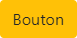
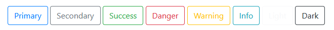
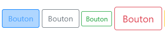
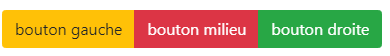

# <div style="color: #26B260">**Les boutons.**</div>

[Sommaire](./00-Sommaire.md)

La classe de base pour le style des boutons est <span style="color: yellow">*.btn*</span>

```html
<button type="button" class="btn">Bouton</button>
```

<span style="color: yellow">*.btn-warning*</span>, pour remplir de couleur un bouton.

```html
<button type="button" class="btn btn-warning">Bouton</button>
```



<span style="color: yellow">*.btn-outline*</span>, colorie le texte et le contour.



```html
    <button type="button" class="btn btn-outline-primary">Primary, bleu</button>
    <button type="button" class="btn btn-outline-secondary">Secondary, gris</button>
    <button type="button" class="btn btn-outline-success">Success, vert</button>
    <button type="button" class="btn btn-outline-danger">Danger, rouge</button>
    <button type="button" class="btn btn-outline-warning">Warning, orange</button>
    <button type="button" class="btn btn-outline-info">Info, bleu ciel</button>
    <button type="button" class="btn btn-outline-light">Light, blanc</button>
    <button type="button" class="btn btn-outline-dark">Dark, noir</button>
```

<span style="color: yellow">*.btn-lg ou .btn-sm*</span>, taille des boutons (lg, large)(sm, small) etc....



<span style="color: yellow">*.btn-group*</span>, pour grouper les boutons.



```html
    <div class="btn-group">
        <button type="button" class="btn btn-warning">bouton gauche</button>
        <button type="button" class="btn btn-danger">bouton milieu</button>
        <button type="button" class="btn btn-success">bouton droite</button>
    </div>
```

En remplaçant <span style="color: yellow">*.btn-group*</span> par<span style="color: yellow">*.btn-group-vertical*</span> , on obtient un groupe de boutons alignés verticalement.
