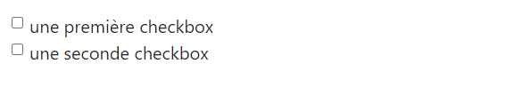

# <div style="color: #26B260">**Les formulaires.**</div>

[Sommaire](./00-Sommaire.md)

Par défaut, Bootstrap applique le style display: block à la majorité des éléments des formulaires.

<span style="color: yellow">*.form-control*</span>, permet de styliser et d'afficher l'élément sur toute la largeur du formulaire, appliqué à la balise (input).

<span style="color: yellow">*.form-group*</span>, groupe un label et un champ de formulaire.

```html
    <div class="form-group">
          <label>Element de formulaire</label>
          <input type="text" class="form-control" id="element" placeholder="Mon placeholder">
    </div>
```


<span style="color: yellow">*.form-control-lg*</span>, gérer le dimensionnement et la hauteur des champs.

<span style="color: yellow">*.form-control-md*</span>, gérer le dimensionnement et la hauteur des champs, valeur par défaut.

<span style="color: yellow">*.form-control-sm*</span>, gérer le dimensionnement et la hauteur des champs.


```html
    <div class="form-group">
        <label for="username">.form-control-lg</label>
        <input type="text" class="form-control form-control-lg" id="username">
        <label for="password">.form-control-sm</label>
        <input type="password" class="form-control form-control-sm" id="password">
    </div>
```

<span style="color: yellow">*.form-check*</span>, les champs de type radio ou checkbox d'un formulaire sont par défaut affichés les uns en dessous des autres.

```html
    <!-- form-check -->
    <div class="form-check">
        <input class="form-check-input" type="checkbox" value="" id="check">
        <label class="form-check-label" for="check">
            une première checkbox
        </label>
    </div>
    <div class="form-check">
        <input class="form-check-input" type="checkbox" value="" id="check">
        <label class="form-check-label" for="check">
            une seconde checkbox
        </label>
    </div>      
```



<span style="color: yellow">*.form-check-inline*</span>, les champs de type radio ou checkbox d'un formulaire seront afficher en ligne.

```html
    <!-- form-check-inline-->
    <div class="form-check-inline">
        <input class="form-check-input" type="checkbox" value="" id="check">
        <label class="form-check-label" for="check">
            une première checkbox inline
        </label>
    </div>
    <div class="form-check-inline">
        <input class="form-check-input" type="checkbox" value="" id="check">
        <label class="form-check-label" for="check">
            une seconde checkbox inline
        </label>
    </div>
```


