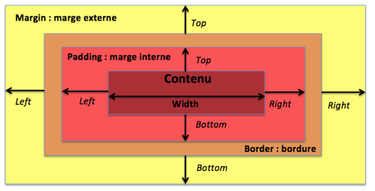

<span style="color:#26f260;">**9. Le CSS des boîtes.**</span><br>
[Retour au sommaire](1-Sommaire.md)<br>

<span style="color:#26f260;">*La propriété display.*</span><br>
La propriété CSS display permet de gérer l'affichage d'un élément par rapport aux autres dans la page.<br>
- Avec la valeur <span style="color:#26f260;">*display: inline*</span>, les éléments vont être placés côte à côte sur la même ligne. L'élément ne prendra que la largeur nécessaire à l'affichage de son contenu, jusqu'à ce qu'il n'y ait plus d'espace en longueur. Les éléments suivants seront alors mis à la ligne. Les propriétés <span style="color:#26f260;">*width*</span> et <span style="color:#26f260;">*height*</span> n'ont aucun effet sur un élément inline.<br>
````css
    .inline {
    display: inline;
    }
````
- Avec la valeur <span style="color:#26f260;">*display: block*</span>, les éléments vont s'empiler les uns sur les autres. Un élément occupera donc une ligne (il prendra toute la largeur, peu importe la taille de son contenu), il ne sera jamais côte à côte avec un autre élément.
````css
    .block {
    display: block;
    }
````
- La valeur <span style="color:#26f260;">*display: inline-block*</span>, quant à elle, partage certaines caractéristiques des propriétés précédentes. En effet, elle est affectée par les propriétés permettant la modification de ses dimensions, et les éléments seront placés côte à côté jusqu'à remplir tout l'espace sur la ligne. Les propriétés <span style="color:#26f260;">*width*</span> et <span style="color:#26f260;">*height*</span> sont actives
````css
    nav li {
    display: inline;
    width: 150px;
    height: 50px;
    line-height: 50px;
    text-align: center;
    border: 1px solid red;
    }
````
Il est possible de définir la hauteur et la largeur minimales d'un élément grâce aux propriétés <span style="color:#26f260;">*min-width*</span> et <span style="color:#26f260;">*min-height*</span>. Si la taille du bloc diminue, elle ne pourra pas être inférieure aux valeurs des propriétés <span style="color:#26f260;">*min-width*</span> et <span style="color:#26f260;">*min-height*</span>.<br>

De même qu'il est possible de définir la hauteur et la largeur maximales d'un élément avec les propriétés <span style="color:#26f260;">*max-width*</span> et <span style="color:#26f260;">*max-height*</span>.

La propriété <span style="color:#26f260;">*overflow*</span> permet de gérer la façon dont le contenu dépasse d'une boîte :

<span style="color:#26f260;">*overflow: hidden*</span> permet de le cacher, le contenu sera alors tronqué

<span style="color:#26f260;">*overflow: scroll*</span> fait apparaître les barres de défilement, qui permettront de scroller dans l'élément pour afficher le contenu

Par défaut, la propriété est <span style="color:#26f260;">*overflow: visible*</span>, ce qui implique que le contenu (s'il dépasse les limites de son conteneur) ne sera pas rogné.

<span style="color:#26f260;">*margin*</span> est la propriété qui permet de gérer l'espace le plus à l'extérieur de l'élément. Elle va déterminer l'espace entre l'élément et les autres : il s'agit de la marge externe de l'élément.

<span style="color:#26f260;">*border*</span> est la propriété qui représente la bordure directement autour de l'objet.

<span style="color:#26f260;">*padding*</span> est la propriété juste autour du contenu, qui permet de gérer les marges internes à l'élément.

Ces propriétés peuvent être manipulées et modifiées afin d'espacer des éléments, ou de donner plus de marge autour d'un contenu.



<span style="color:#26f260;">*Centrer horizontalement*</span>.
Utiliser la propriété de largeur <span style="color:#26f260;">*width*</span>, associée à la propriété et la valeur <span style="color:#26f260;">*margin: auto*</span>, permet de centrer horizontalement le contenu d'un élément.<br>
