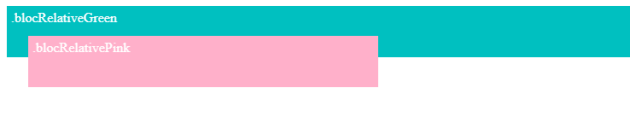

<span style="color:#26f260;">**15. Positions.**</span><br>
[Retour au sommaire](1-Sommaire.md)<br>

Le positionnement static c'est la valeur par défaut : les éléments se positionnent les uns à la suite des autres en suivant leur ordre d'écriture dans le document HTML.<br>
````css
    .static {
    position: static;
    } 
````
Le positionnement absolute permet de placer un élément où l'on souhaite sur la page en tenant compte de son parent.<br>

Le positionnement fixed est équivalent au positionnement absolu, mais l'élément concerné restera toujours visible au même endroit, même si l'on descend plus bas dans la page.<br>

Le positionnement relative permet de déplacer un élément par rapport à sa position initiale.<br>
En ajoutant des propriétés, notamment les propriétés top, left, bottom ou right, cela permet d'ajuster la position de l'élément par rapport à sa position initiale, dictée par les autres éléments autour de lui.<br>
````html
    <div class="blocRelativeGreen">
    .blocRelativeGreen
    </div>
    <div class="blocRelativePink">
        .blocRelativePink
    </div> 
````
````css
    .blocRelativeGreen {
    position: relative;
    height: 50px;
    background: #00BFBF;
    color: white;
    padding: 5px;
}
.blocRelativePink {
    position: relative;
    top: -25px;
    left: 25px;
    width: 400px;
    height: 50px;
    background: #FFAEC9;
    color: white;
    padding: 5px;
} 
````


