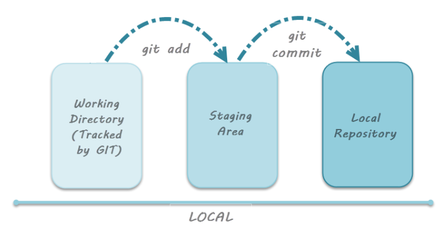

# Modification en cours

[Sommaire](./00-Sommaire.md)

    On vérifie l'état des modifications en cours grâce à la commande git status.

    Tout nouveau fichier créé depuis le dernier commit est considéré comme non-suivi.

    Tout fichier modifié depuis le dernier commit est automatiquement considéré comme suivi.

    Pour que des modifications soient enregistrées dans un commit, celles-ci doivent au préalable être ajoutées à la zone de staging. C'est le rôle de la commande git add.

## Le cycle de vie des fichiers

Il est fondamental de bien visualiser le cycle de vie des fichiers dans Git.

Tout d'abord, ceux-ci peuvent se trouver dans deux états :

    Sous suivi de version, ou tracked : il s'agit des fichiers qui étaient déjà présents lors du dernier état des lieux du système,

    Non-suivi, ou untracked : à l'inverse, il s'agit des fichiers qui n'étaient pas présents lors du dernier état des lieux ou qui ont été supprimés depuis celui-ci.

Par défaut, lors de l'initialisation d'un nouveau dépôt, l'ensemble des fichiers présents seront considérés comme non-suivis.

Lorsqu'un fichier est suivi, celui-ci peut se trouver dans trois états différents, à savoir :

    Non modifié, ou unmodified : le fichier est suivi par Git, mais n'a pas été modifié depuis le dernier état des lieux,

    Modifié, ou modified : le fichier est suivi par Git et a été modifié depuis le dernier état des lieux,

    Indexé, ou staged : le fichier a été modifié et ces modifications ont été indexées, mais pas encore enregistrées depuis le dernier état des lieux. Si l'on effectue un commit, c'est-à-dire une sauvegarde, seuls les fichiers indexés seront modifiés.

## Consulter l'état de l'espace de travail

Afin de vérifier l'état des modifications apportées, il existe une commande appelée git status.

Cette commande permet de visualiser les fichier non-suivis, modifiés ou indexés.

## Ajouter des fichiers modifiés

Pour ajouter un changement dans le répertoire de travail à la zone de staging, il est nécessaire d'utiliser la commande git add.

Cependant, le fait d'utiliser la commande git add n'impacte pas le dépôt de manière significative. Les modifications ne seront enregistrées que lorsque la commande git commit aura été exécutée.

