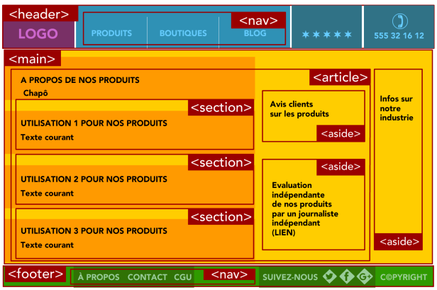

# <div style="color: #26B260">**5. Récapitulation des balises.**</div>

[Sommaire](./00-Sommaire.md)

<span style="color: #26B260">**1. Balises de premier niveau.**</span>

<span style="color: red"><**html**></span> Balise principale.

<span style="color: red"><**head**></span> En-tête de la page.

<span style="color: red"><**body**></span> Corps de la page.

<span style="color: #26B260">**2. Balises d'en-tête.**</span>

<span style="color: red"><**link** /></span> Liaison avec une feuille de style.

<span style="color: red"><**meta** /></span> Métadonnées de la page web (charset, mots-clés, etc.).

<span style="color: red"><**script**></span> Code JavaScript.

<span style="color: red"><**style**></span> Code CSS.
<span style="color: red"><**title**></span> Titre de la page.


<span style="color: #26B260">**3. Balises de structuration du texte.**</span>

<span style="color: red"><**abbr** /></span> Abréviation.

<span style="color: red"><**blockquote** /></span> Citation (longue).

<span style="color: red"><**cite**></span> Citation du titre d'une œuvre ou d'un évènement.

<span style="color: red"><**q**></span> Citation (courte).

<span style="color: red"><**sup**></span> Exposant.
<span style="color: red"><**sub**></span> Indice.

<span style="color: red"><**strong**></span> Mise en valeur forte.

<span style="color: red"><**em**></span> Mise en valeur normale.

<span style="color: red"><**mark**></span> Mise en valeur visuelle.

<span style="color: red"><**h1**></span> Titre de niveau 1

<span style="color: red"><**h2**></span> Titre de niveau 2

<span style="color: red"><**h3**></span> Titre de niveau 3

<span style="color: red"><**h4**></span> Titre de niveau 4

<span style="color: red"><**h5**></span> Titre de niveau 5

<span style="color: red"><**h6**></span> Titre de niveau 6

<span style="color: red"><**img** /></span> Image

<span style="color: red"><**figure**></span> Figure (image, code, etc.)

<span style="color: red"><**figcaption**></span> Description de la figure

<span style="color: #26B260">**Le multimédia.**</span>

<span style="color: red"><**audio**></span> Son

La balise <span style="color: red"><**audio**></span> permet d'ajouter des sons à une page HTML sous forme de lecteur audio. Cette balise peut prendre la propriété optionnelle <span style="color: lightgreen">*controls*</span> afin de faire apparaître les commandes sur le lecteur audio.

Il faut ajouter au moins une balise source entre les balises audio, afin de définir la source et le type de média audio à importer.

Le texte placé entre les balises au même niveau que les sources sera le message d'erreur qui s'affichera si la balise ne peut pas être affichée sur le navigateur.

````html
   <audio controls>
   <source src="music.ogg" type="audio/ogg">
   <source src="music.wav" type="audio/wav">
   <source src="music.mp3" type="audio/mpeg">
   Message à afficher en cas de non support de la balise par le navigateur.
</audio>
````


<span style="color: red"><**video**></span> Vidéo.

l'attribut <span style="color: lightgreen">*controls*</span>, fera apparaître les contrôles vidéo dans le lecteur, tels que lecture, pause et volume.

l'attribut <span style="color: lightgreen">*autoplay*</span> fera que la vidéo sera automatiquement jouée au chargement de la page.

Une bonne pratique est de toujours donner des dimensions de la vidéo via l'utilisation des attributs : <span style="color: lightgreen">*width*</span> et <span style="color: lightgreen">*height*</span> en pixels.

```html
   <video width="320" height="240" autoplay controls>
        < !--lien vers la vidéo-->
    </video>
```

<span style="color: red"><**source**></span> Format source pour les balises audio  et video.

Entre les balises video, il faut ajouter au moins une balise source, accompagnée des attributs <span style="color: lightgreen">*src=" "*</span> et <span style="color: lightgreen">*type=" "*</span> pour spécifier la source (le chemin vers la vidéo sur l'ordinateur ou le serveur) et le type, c'est-à-dire le format de la vidéo.

Le fait d'ajouter plusieurs balises source permet de déclarer des fichiers alternatifs à afficher : le navigateur va choisir le premier format qu'il reconnaît.

Le texte placé entre les balises sera le message d'erreur qui s'affichera si la balise ne peut pas être affichée sur le navigateur car elle n'est pas supportée.

```html
   <video width="320" height="240" autoplay controls>
   <source src="video.mp4" type="video/mp4">
   <source src="video.ogg" type="video/ogg">
   <source src="video.webm" type="video/webm">
   Message à afficher en cas de non support de la balise par le navigateur.
</video>
```

<span style="color: red"><**iframe**></span>  (pour inline frame) peut être paramétrée pour inclure différents types de contenu.

Elle met une enclave dans ma page, pour ne pas perdre le flot de l'utilisateur, c'est comme ci vous avez une fenêtre de navigation dans votre page.width et height n'ont pas besoin de px commme pour la balise vidéo, elle est inplicite.src est la cible de la ressource que je souhaite insérer dans ma page .

lien vers un site externe.

```html
   <iframe
        src="https://www.site.com/iframe.html"
        name="Mon Iframe"
        width="500"
        height="250">
    </iframe>
```

Lien interne vers une autre page de mon site.

```html
   <iframe
        src="a-propos.html"
        name="Mon Iframe"
        width="500"
        height="250">
    </iframe>
```

<span style="color: lightgreen">*Lien vers google maps.*</span>

Après avoir choisi votre carte, allez dans le menu de google maps et sélectionné partager ou intégrer la carte, choisissez intégrer une carte et copié l'iframe dans votre code.

<span style="color: lightgreen">*Lien vers youtube.*</span>
Après avoir choisi votre vidéo, allez sur youtube, faire partager puis intégrer.

Copié l'iframe dans votre code.

<span style="color: red"><**object**></span> Pour ajouter des objets.

Les attributs : <span style="color:lightgreen">*type="application/pdf"*</span> pour déclarer que nous souhaitons importer un fichier de type PDF, et <span style="color: lightgreen">*data="Mon_fichier.pdf"*</span> qui indique le chemin vers la ressource cible.

```html
   <object
        type="application/pdf"
        data="Mon_fichier.pdf"
        width="400"
        height="350">
    </object>
```

<span style="color: red"><**a**></span> (pour anchor, qui signifie ancre) permet d'inclure un lien dans une page HTML.

```html
   <a href="URL du lien" title="ceci est un lien">Lien externe</a>
```

Le lien vers lequel l'élément pointe est spécifié par l'attribut <span style="color: lightgreen">*href=" "*</span>.

L'attribut <span style="color: lightgreen">*title=" "*</span> permettant d'ajouter un titre au lien, celui-ci sera affiché à l'utilisateur au survol du lien avec la souris.<br>
<span style="color: lightgreen">**Image cliquable.**</span> 

```html
   <a href="URL">
        
    </a>

```

Ajouter un <span style="color: lightgreen">*préfixe tel: ou mailto:*</span> pour déclencher un appel téléphonique sur mobile, ou pour envoyer un courriel.

```html
    <a href="tel:0600000000">06 00 00 00 00</a>
    <a href="mailto:email@example.com">Envoyer un courriel</a>  
```

<span style="color: #FFC300">**Les ancres**</span> sont des liens pointant vers des éléments internes à la page.

Celui-ci doit pointer vers un élément de la page qui comporte un identifiant, c'est-à-dire un attribut <span style="color: lightgreen">*id=" "*</span>, et utiliser un <span style="color: lightgreen">*dièze (#)*</span> pour référencer cet identifiant : <span style="color: lightgreen">*href*</span><span style="color: #FFC300">*="#identifiant-de-mon-element"*</span>.

```html
   <a href="#identifiant-de-mon-element">Lien vers un élément interne(ancre)</a>
    <div id="identifiant-de-mon-element">identifiant de l'ancre avec id, plus loin dans la page.
```

L'attribut optionnel <span style="color: lightgreen">*target=" "*</span> utilisé sur un lien <span style="color: red"><**a**></span> permet de déterminer l'endroit où va s'ouvrir le lien.

Par défaut,le lien va s'afficher dans la fenêtre actuelle du navigateur, il est possible de faire ouvrir un nouvel onglet au clic sur le lien, avec la propriété <span style="color: lightgreen">**target="_blank"*</span>.

```html
   <a href="URL" target="_blank">Cette page s'ouvrira dans un autre onglet</a>
```

<span style="color: red"><**br** /></span> Retour à la ligne.

<span style="color: red"><**p**></span> Paragraphe.

<span style="color: red"><**hr** /></span> Ligne de séparation horizontale.

<span style="color: red"><**address**></span> Adresse de contact.

<span style="color: red"><**del**></span> Texte barré.

<span style="color: red"><**ins**></span> Texte inséré.

<span style="color: red"><**audio**></span> Son.

<span style="color: red"><**dfn**></span> Définition.

<span style="color: red"><**kbd**></span> Saisie clavier.

<span style="color: red"><**pre**></span> Affichage formaté (pour les codes sources).

<span style="color: red"><**progress**></span> Barre de progression.

<span style="color: red"><**time**></span> Date ou heure.

<span style="color: #26B260">**4. Balises de listes.**</span>
<span style="color: red"><**ul**></span> Liste à puces, non numérotée.

<span style="color: red"><**ol**></span> Liste numérotée.

<span style="color: red"><**li**></span> Élément de la liste à puces.

<span style="color: red"><**dl**></span> Liste de définitions.

<span style="color: red"><**dt**></span> Terme à définir.

<span style="color: red"><**dd**></span> Définition du terme.

<span style="color: #26B260">**5. Balises de tableau.**</span>

<span style="color: red"><**table**></span> Tableau.

<span style="color: red"><**caption**></span> Titre du tableau.

<span style="color: red"><**tr**></span> Ligne de tableau.

<span style="color: red"><**th**></span> Cellule d'en-tête.

<span style="color: red"><**td**></span> Cellule.

<span style="color: red"><**thead**></span> Section de l'en-tête du tableau.

<span style="color: red"><**tbody**></span> Section du corps du tableau.

<span style="color: red"><**tfood**></span> Section du pied du tableau.


<span style="color: #26B260">**6. Balises de formulaire.**</span>

<span style="color: red"><**form**></span> Formulaire.

<span style="color: red"><**fieldset**></span> Groupe de champs.

<span style="color: red"><**legend**></span> Titre d'un groupe de champs.

<span style="color: red"><**label**></span> Libellé d'un champ.

<span style="color: red"><**input**></span> Champ de formulaire (texte, mot de passe, case à cocher, bouton, etc.).

<span style="color: red"><**textarea**></span> Zone de saisie multiligne.

<span style="color: red"><**select**></span> Liste déroulante.

<span style="color: red"><**option**></span> Élément d'une liste déroulante.

<span style="color: red"><**optgroup**></span> Groupe d'éléments d'une liste déroulante.

<span style="color: #26B260">**7. Balises sectionnantes.**</span>

<span style="color: red"><**header**></span> En-tête.

<span style="color: red"><**nav**></span> Liens principaux de navigation.

<span style="color: red"><**footer**></span> Pied de page.

<span style="color: red"><**section**></span> Section de page.

<span style="color: red"><**article**></span> Article (contenu autonome).

<span style="color: red"><**aside**></span> Informations complémentaires.

<span style="color: #26B260">**8. Balises génériques.**</span>

Parfois, on a besoin d'utiliser des balises génériques (aussi appelées balises universelles) car aucune des autres balises ne convient. On utilise le plus souvent des balises génériques pour construire son design.
<span style="color: red"><**span**></span> Balise générique de type inline.

<span style="color: red"><**div**></span> Balise générique de type block.

Ces balises ont un intérêt uniquement si vous leur associez un attribut class  , id  ou style  :

- class : indique le nom de la classe CSS à utiliser.

- id : donne un nom à la balise. Ce nom doit être unique sur toute la page car il permet d'identifier la balise. Vous pouvez vous servir de l'id pour de nombreuses choses, par exemple pour créer un lien vers une ancre, pour un style CSS de type id, pour des manipulations en JavaScript, etc.

- style  : cet attribut vous permet d'indiquer directement le code CSS à appliquer. Vous n'êtes donc pas obligé d'avoir une feuille de style à part, vous pouvez mettre directement les attributs CSS. Notez qu'il est préférable de ne pas utiliser cet attribut et de passer à la place par une feuille de style externe, car cela rend votre site plus facile à mettre à jour par la suite.

Ces trois attributs ne sont pas réservés aux balises génériques : vous pouvez aussi les utiliser sans aucun problème dans la plupart des autres balises.

<span style="color:#26f260;">**9. Les conteneurs génériques**</span>

<span style="color: red"><**div**></span> permet surtout de regrouper des éléments dans un même bloc (on dit alors que la div est un élément de type bloc), afin de les styliser avec du CSS plus simplement.

<span style="color: red"><**span**></span>, à la différence de <span style="color: red"><**div**></span>, place les éléments en ligne (balise de type inline), ce qui permet de l'inclure facilement dans des paragraphes ou des boutons, par exemple.

<span style="color:#26f260;">**10. Balises sémantiques**</span>



La balise <span style="color: red"><**header**></span> va grouper tous les éléments d'en-tête de la page, comme le logo.

L'élément <span style="color: red"><**nav**></span> permet de naviguer à travers le site : il s'agit du menu de navigation.

La balise <span style="color: red"><**main**></span> comporte toutes les informations importantes de la page : il s'agit du contenu principal.

L'élément <span style="color: red"><**article**></span> contient une information qui est indépendante du reste de la page : par exemple, lorsque nous représentons une galerie d'articles, les articles sont indépendants les uns des autres (ils pourraient exister les uns sans les autres).

La balise <span style="color: red"><**section**></span> est une balise d'organisation de contenu, mais cette fois-ci les données qu'elle contient sont dépendantes du contexte, une section isolée perd le sens de la donnée qu'elle contient.

L'élément <span style="color: red"><**aside**></span> va regrouper des éléments en marge du contenu. Cela peut être intéressant pour contenir des publicités, par exemple. En effet, ces dernières n'ont pas toujours de lien avec le contenu de la page.

La balise <span style="color: red"><**footer**></span> est le pied de page, il est possible de trouver les mentions légales et les liens vers les informations de contact.

Ces balises n'ont pas d'impact visuel sur la page, mais elles permettent d'améliorer le sens des données qu'elles contiennent. Elles doivent toutes être utilisées dans la balise <span style="color: red"><**body**></span>.

```html
<!DOCTYPE html>
<html lang="fr">
   <head>
      <meta charset="utf-8"/>
      <title>Titre dans l'onglet du navigateur</title>
      <link rel="stylesheet" href="monFichierCSS.css">
   </head>
   <body>
      <header>
         <nav role="navigation">
            <ul>
               <li><a href="#">Ma présentation</a></li>
               <li><a href="#">Mes projets</a></li>
               <li><a href="#">Me contacter</a></li>
            </ul>
         </nav>
      </header>
      <main>
         <section>
            <article>
               <h2>Mon site personnel</h2>
               <p>
                  Lorem ipsum dolor sit amet, consectetur .
               </p>
            </article>
            <article>
               <h2>Mon parcours</h2>
               <p>
                  Lorem ipsum dolor sit amet, consectetur 
               </p>
            </article>
         </section>
         <aside>
            <article>
               <h2>Qui suis-je ?</h2>
               <p>
                   adipiscing elit.
               <h3>Mes passions</h3>
               <ul>
                  <li>Les chats</li>
                  <li>Le sport</li>
                  <li>La musique</li>
               </ul>
               </p>
            </article>
         </aside>
      </main>
      <footer>
         <p>Tous droits réservés</p>
      </footer>
   </body>
</html>
```
