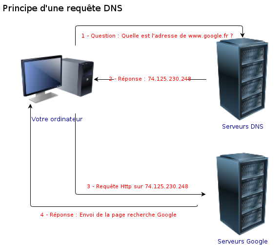

# Internet

[Sommaire](./00-Sommaire.md)

    Le terme "Internet" désigne un réseau de communication qui relie tous les ordinateurs.

    Les serveurs sont des ordinateurs sur un réseau, qui ont été configurés pour retourner un résultat (souvent, une page web).

    Chaque ordinateur possède une adresse IP qui lui permet de communiquer avec les autres via le protocole TCP/IP.

    Les serveurs possèdent un nom de domaine qui est converti en adresse IP par le DNS.

Internet est un réseau de communication mondial entre ordinateurs, créé à l'origine pour aider l'armée américaine dans les années 60, sous le nom de projet ARPAnet.

## Le protocole

Le protocole TCP/IP désigne donc la manière dont les messages entre les ordinateurs transitent sur le réseau. Ce protocole est en réalité la fusion de deux protocoles : TCP (Transmission Control Protocol), qui désigne la manière dont les messages doivent être écrits et leur formalisme, et IP (Internet Protocol), qui désigne la manière d'attribuer un identifiant unique à un ordinateur pour pouvoir le retrouver.

## TCP/IP

TCP/IP est l'équivalent de la Poste pour les ordinateurs. Si on veut envoyer un courrier postal, alors chaque maison doit posséder une adresse unique : c'est l'équivalent du protocole IP, qui définit une adresse IP pour chaque ordinateur sur le réseau. Cette adresse IP prend la forme de 4 nombres compris entre 0 et 255 et séparés par des points. Par exemple, 21.245.3.98 est une adresse IP valide.

Reprenons notre courrier postal : notre message doit être contenu dans une enveloppe timbrée ayant une taille précise et sur laquelle l'adresse de l'émetteur et du destinataire doivent être écrites à des endroits précis. C'est l'équivalent du TCP, qui définit un format particulier pour les échanges et les messages.

## Les Noms de domaine

Les noms de domaine sont les noms sous lesquels nous connaissons les sites web. Ils sont composés d'un domaine de premier niveau (ou TLD, pour Top-Level Domain), que l'on connaît plus généralement sous le nom d'extension, d'un domaine et, parfois, d'un ou plusieurs sous-domaines, tous séparés par des points.

Les TLD se placent à la fin du nom de domaine et indiquent leur provenance ("fr" pour la France, "be" pour la Belgique...) ou le type de site Internet ("com" pour "commercial", "org" pour "organisation"...).

Les domaines sont le nom du site, comme "google" ou "wikipedia".

Enfin, les sous-domaines peuvent définir des sous-parties d'un même domaine. Par exemple, "mail" et "drive" sont deux sous-domaines de "google.com", puisque les sites "mail.google.com" et "drive.google.com" existent.

## DNS

 le DNS, pour Domain Name System. Le principe est simple : il existe des serveurs DNS sur le réseau qui possèdent une liste de noms de domaines et des adresses IP associées. Il suffit donc ensuite de leur donner un nom de domaine pour qu'ils retournent l'adresse IP correspondante. Ce processus est géré de manière complètement invisible pour l'utilisateur.

 
