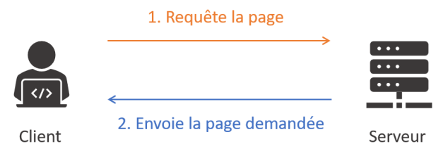

# Les sites Web

[Sommaire](./00-Sommaire.md)

    Un site est un ensemble de pages, hébergées sur un serveur.

    Lorsque l'on navigue sur un site web, notre navigateur (le client) envoie des requêtes grâce au protocole HTTP au serveur, afin de récupérer le code source présent sur ce dernier. Une fois ce code récupéré, le navigateur l'interprète et l'affiche.

    Un site web est accessible grâce à son URL, qui permet de l'identifier parmi les autres sites.

    En fonction des éléments présents sur un site, on fait la distinction entre site statique et site dynamique.

    Un site statique est un site dont le contenu ne changera pas, contrairement à un site dynamique qui est rendu interactif par l'usage de scripts.

Un site web est un ensemble de pages web, hébergées sur un serveur.

Il est possible de rechercher parmi les sites web à l'aide d'un moteur de recherche (Google, Yahoo, Bing, Qwant...) depuis un logiciel appelé navigateur web (Mozilla Firefox, Google Chrome, Microsoft Edge...) qui permet d'afficher les contenus web.

Le "Web" et "Internet" sont deux choses bien distinctes : les sites web utilisent Internet pour fonctionner.

## Back-end vs Front-end

On différencie le « back-end », qui est la partie du code exécuté par le serveur pour générer nos pages web, du « front-end », partie visible d'un site web, soit le code exécuté par le navigateur. Le HTML, le CSS et le JavaScript sont ainsi les trois grandes composantes de ce que doit connaître un développeur front-end. Pour le back-end, de nombreux langages existent, mais le plus utilisé est le PHP.

## Les différents types de site

Suivant les éléments présents sur un site et les interactions possibles, on fait la distinction entre site statique et site dynamique :

    Un site statique est un site qui ne contiendra que des éléments prédéfinis en dur. Peu importe qui le consulte ou à quel moment de la journée, à chacune de nos visites, il restera le même.

    Un site dynamique est, au contraire, un site qui permet d'effectuer des actions (se connecter, écrire un commentaire) qui feront changer son contenu en fonction des actions que nous allons effectuer.

Les pages statiques sont plus simples à développer, mais permettront moins d'interactions, tandis que les sites dynamiques sont plus complexes, mais aussi plus interactifs.

Ces deux types de sites n'ont pas le même but : un site statique sera plus adapté à la réalisation d'un site vitrine, ne faisant que de la présentation d'information qui ne change pas fréquemment ; un site dynamique sera adapté à la réalisation d'un site de vente en ligne, avec un système de panier, de création de compte, de gestion des commandes...

## Schéma récapitulatif

Une requête est avant tout un moyen d'échange entre un client (le navigateur, donc l'utilisateur) et un serveur qui stocke les données que nous cherchons.

Le protocole HTTP (Hyper Text Transfert Protocol), qui permet au client d'accéder au serveur qui contient les données que nous demandons.

Une fois ce code récupéré, il peut être interprété et affiché par le navigateur.

Il existe de nombreux serveurs HTTP, c'est-à-dire des serveurs qui respectent ce standard et permettent de réceptionner les requêtes d'un client pour les traiter et retourner les données. Les deux exemples les plus connus sont Apache et NGINX.

## HTTPS

Aujourd'hui, c'est la variante sécurisée de HTTP qui est la plus démocratisée : HTTPS (on ajoute le S pour secured, qui veut dire sécurisé). L'usage d'un certificat permet de rendre les échanges sécurisés, qui sont alors chiffrés.

Un certificat est un contrat entre un organisme "de confiance" et vous, permettant de vérifier l’identité numérique d'un site.

## Identifier une page web

Une page web est identifiable par son URL (Uniform Ressource Locator). Elle permet de la retrouver et de l'identifier parmi toutes les autres pages disponibles sur le site : on parle d'adresse web. C'est grâce à cette adresse que l'on va pouvoir effectuer des requêtes sur des ressources précises.

Une URL correspond toujours au même schéma :protocole://nom-de-domaine/chemin/ressource.

protocole:// => https://

nom-de-domaine/ => fr.wikipedia.org

chemin/ressource => /wiki/Uniform_Resource_Locator

## Fonctionnement des sites web

En résumé

    Le Web a été inventé par Tim Berners-Lee au début des années 1990.

    Pour créer des sites web, on utilise deux langages informatiques :

        HTML : permet d'écrire et organiser le contenu de la page (paragraphes, titres…) ;

        CSS : permet de mettre en forme la page (couleur, taille…).

    Il y a eu plusieurs versions des langages HTML et CSS. Les dernières versions sont HTML5 et CSS3.

    Le navigateur web est un programme qui permet d'afficher des sites web. Il lit les langages HTML et CSS pour savoir ce qu'il doit afficher.

    Il existe de nombreux navigateurs web différents : Google Chrome, Mozilla Firefox, Internet Explorer, Safari, Opera… Chacun affiche un site web de manière légèrement différente des autres navigateurs.

    Dans ce cours, nous allons apprendre à utiliser les langages HTML et CSS. Nous travaillerons dans un programme appelé « éditeur de texte » (Sublime Text, Notepad++, jEdit, vim…).
