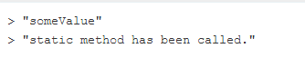

# <div style="color: #26B260">Les classes : Déclarer une classe</div>

[Sommaire](./00-Sommaire.md)

Une classe c'est un type de fonction, qui permet de créer des objets.

On utilise le mot clé class, puis le nom de la classe avec une majuscule au début et sur chaque nouveau mots qui suit.Après on ouvre des accolades

```javascript
    // déclaration de la class
    class User {
    
    }   
    // création d'une instance de la class User avec new User().
    let user = new User();

    // Ajouter une propriété avec sa valeur dans une instance.
    user.name = "Jean";

    // afficher l'instance de la variable user
    console.log(user);
```

Une instance et un objet crée à partir de la class.

Les classes sont des modèles d'objets.

## <span style="color: #26B260">Les classes : Propriété par défaut</span>

```javascript
    // déclaration de la class(modèle).
    class User {
        name = "Jean";// propriété de la class User.
        age = 22;
        presence;// pas de valeur, affichera undefined
    }   
    // création d'une instance de la class User avec new User().
    let user = new User();

    // afficher l'instance de la variable user
    console.log(user);
```

## <span style="color: #26B260">Les classes : La fonction "constructor()"</span>

La méthode constructor(), elle sert à créer le nouvel objet.C'est un mot réserve à javascript.

```javascript
    // déclaration de la class(modèle).
    class User {
        name;// propriété de la class User.
        age;
        presence;
        pays = "France";// valeur par défaut.
        
        constructor(name, age, presence = false) {
            this.name = name;// propriété dynamique.
            this.age = age;
            this.presence = presence;
        }
        
    }   
    // création d'une instance de la class User avec new User().
    let user = new User("Tom", 27, true);
    let user2 = new User("Sam", 34);

    // afficher l'instance de la variable user
    console.log(user);
    console.log(user2);
    
```

## <span style="color: #26B260">Les classes : Ajouter des méthodes</span>

```javascript
    // Modèle
    class User {
        name;// propriété de la class User.
        age;
        presence;
        pays = "France";// valeur par défaut.
        
        constructor(name, age, presence = false) {
            this.name = name;// propriété dynamique.
            this.age = age;
            this.presence = presence;
        }
        // déclaration d'une méthode
        isPresent() {
            return this.presence;
        }
        
        // déclaration seconde méthode.
        say(str) {
            console.log(this.name + ' : ' + str);
        }
        
    }   
    // création d'une instance de la class User avec new User(), ce sont ddes objets.
    let user = new User("Tom", 27, true);
    let user2 = new User("Sam", 34);

    // pour accéder à la méthode.
    // user.isPresent();
    //user2.isPresent();
    
    // afficher l'instance de la variable user
    console.log(user, user.isPresent());
    console.log(user2, user.isPresent());
    
    user.say("Bonjour " + user2.name);
    user2.say("Bonjour " + user.name);
```

## <span style="color: #26B260">Les classes : Héritage entre les classes</span>

```javascript
    // modèle
    class Vehicle {
        constructor(name, wheels) {
            this.name = name;
            this.wheels = wheels;// Nbre de roues.
        }
        
        accelerate() {
            
        }
        
        brake() {
            
        }
        
        turn() {
            
        }
        
    }
    // extends, pour hérité de la class Vehicle.
    class Car extends Vehicle { 
        // appel du constructor de la class parent (Vehicle) avec le mot clé (super) .
        constructor(name, coffre) {
            super(name, 4);
            this.coffre = coffre;
        }
    }
    
    class MotorBike extends Vehicle {
        constructor(model, hasPassenger = false) {
            super(model, 2)
            this.hasPassenger = hasPassenger;
        }
    }
    
    let car = new Car("Audi", 500);
    let car2 = new Car("Mercedes", 200);
    let moto = new MotorBike('honda', true);
    
    console.log(car);
    console.log(car2);
    console.log(moto);
    
    car.accelerate();
    moto.accelerate();
    car.brake();
    moto.turn();
    
    let bike = new Vehicle("Vélo, 2");
    console.log(bike);
```

## <span style="color: #26B260">Les classes : Propriétés et méthodes "static"</span>

Le mot-clé <span style="color: yellow">static</span> permet de définir une méthode statique d'une classe. Les méthodes statiques ne sont pas disponibles sur les instances d'une classe mais sont appelées sur la classe elle-même. Les méthodes statiques sont généralement des fonctions utilitaires (qui peuvent permettre de créer ou de cloner des objets par exemple).

Les méthodes statiques sont utilisées lorsque la méthode ne s'applique qu'à la classe elle-même et pas à ses instances. Les méthodes statiques sont généralement utilisées pour créer des fonctions utilitaires.

```javascript
    class ClassWithStaticMethod {
    
      static staticProperty = 'someValue';
      static staticMethod() {
        return 'static method has been called.';
      }
    
    }
    
    console.log(ClassWithStaticMethod.staticProperty);
    // affichera en output: "someValue"
    console.log(ClassWithStaticMethod.staticMethod());
    // affichera en output: "static method has been called."

```


