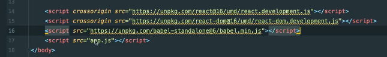
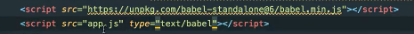

# <span style="color: #26B260">**Syntaxe JSX.**</span>

[Sommaire](./00-Sommaire.md)

Le JSX simplifie le développement, pour l'utiliser il faut un outil externe qui va nous compiler le code JSX en JS natif, pour qu'il soit compatible avec tout les navigateurs.

Cet outil s'appelle babel disponible en ligne via un lien dans la doc.
La façon la plus simple et rapide de tester JSX dans votre projet est d’ajouter la balise (script) ci-dessous à votre page :

```javascript
<script src="https://unpkg.com/babel-standalone@6/babel.min.js"></script>
```



Pour indiquer que le fichier est écrit par babel, il faut mettre dans type="text/babel"  



Code écris en html avec babel

```javascript
const title1 = <h1>Compteur : <span>0</span></h1>
```

## <span style="color: #26B260">**l'interpolation avec les accolades { }.**</span>

Ouvrir des accolades et mettre la variable à l'intérieur.

```javascript
let n =1
function render() {
    const title1 = <h1>Compteur : <span>{n}</span></h1>

    ReactDOM.render(title1, document.querySelector('#app1'));
}

render();

setInterval(() => {
    n++;
    render();
}, 1000);
```

Je peux aussi y mettre le retour d'une fonction(getString()).

```javascript
function getString() {
    return n + ' fois';
}
function render() {
    const title1 = <h1>Compteur : <span>{getString()}</span></h1>

    ReactDOM.render(title1, document.querySelector('#app1'));
}
```

Si je veux le mettre sur plusieurs ligne, il faut que j'insère un espace (white space) avec les accolades.

```javascript
    const title1 = <h1>Compteur : {' '}
            <span>{getString()}</span></h1>
```

On ne peut pas afficher un objet, mais ça valeur.

```javascript
// afficher un objet, créera une erreur.
const title = <h1>Compteur :
    <span>{{name: 'Jean'}}</span>
    </h1>
// par contre on peut afficher la propriété d'un objet.
const title = <h1>Compteur :
    <span>{{name: 'Jean'}.name}</span>
</h1>
```

En JSX, on doit avoir qu'une seule racine pour créer un élément, pour ça on va créer une div et mettre nos éléments dans cette div.Par contre la div s'affiche.

```javascript
// div conteint deux éléments enfants.
const title = <div>
    <h1>Compteur : <span>{n}</span></h1>
    <ul>
        <li>Mon Tag 1</li>
    </ul>
</div>
```

Si on veut que la div ne s'affiche pas, il faut utiliser les fragments.

```javascript
// On utilise React.Fragment ou (<>)
const title = <React.Fragment>
    <h1>Compteur : <span>{n}</span></h1>
    <ul>
        <li>Mon Tag 1</li>
    </ul>
</React.Fragment>
```

Ajuster autant de li qu'il y a de Tag.

On va stocker dans une variable (tagsEl) un tableau d'éléments avec la méthode map().

```javascript
let n = 1;

function render() {
    let tags = [
        'Tag 1',
        'Tag 2',
        'Tag 3'
    ];
    
    const tagsEl =tags.map((tag) => {
        return <li>{tag}</li>
    });
    
    const title = <React.Fragment>
        <h1>Compteur : <span>{n}</span></h1>
        <ul>{tagsEl}</ul>
    </React.Fragment>

    ReactDOM.render(title, document.querySelector(#app));

}

render();

```

Il crée une erreur car React voudrait une key unique à  tags pour identifier la valeur. Rajout de l'attribut key.

```javascript
let n = 1;

function render() {
    let tags = [
        'Tag 1',
        'Tag 2',
        'Tag 3'
    ];
    // Ajout de l'attribut key avec l'index.
    const tagsEl =tags.map((tag, index) => {
        return <li key={index} >{tag}</li>
    });
    
    const title = <React.Fragment>
        <h1>Compteur : <span>{n}</span></h1>
        <ul>{tagsEl}</ul>
    </React.Fragment>

    ReactDOM.render(title, document.querySelector(#app));

}

render();

```

Comment ajouter un id en JSX.

```javascript
let n = 1;

function render() {
    let tags = [
        'Tag 1',
        'Tag 2',
        'Tag 3'
    ];
    // Ajout de l'attribut key avec l'index.
    const tagsEl =tags.map((tag, index) => {
        return <li key={index} >{tag}</li>
    });
    // ajout d'un id sur h1.
    const title = <React.Fragment>
        <h1 id={"title-"+n}>Compteur : <span>{n}</span></h1>
        <ul>{tagsEl}</ul>
    </React.Fragment>

    ReactDOM.render(title, document.querySelector(#app));

}

render();

```

Comment changer la class en JSX, il faut utiliser className.

```javascript
let n = 1;

function render() {
    let tags = [
        'Tag 1',
        'Tag 2',
        'Tag 3'
    ];
    // Ajout de l'attribut key avec l'index.
    const tagsEl = tags.map((tag, index) => {
        return <li key={index}>{tag}</li>
    });
    // ajout d'une className, si je veux quelle soit dynamique j'écris className={"class-"+n}
    const title = <React.Fragment>
        <h1 id={"title-" + n} className="title">Compteur :
            <span>{n}</span>
        </h1>
        <ul>{tagsEl}</ul>
    </React.Fragment>

    ReactDOM.render(title, document.querySelector(#app));
}

render();

```
