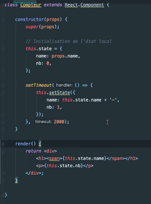

# **Component state.**

[Sommaire](./00-Sommaire.md)

Différence entre les props et les states.

Rappel:

Création d'un composant fonctionnel.

Création d'un composant avec une classe.

Dans les deux cas, on peut passer des propriétés (props)mais au niveau d'un composant fonctionnel il n'aura pas d'état local. Pour cela il faut utiliser une classe.

Un state c'est l'état local d'un composant.

Initialiser un état (state).

Pour modifier le state il faut utiliser la méthode this.setState().

On modifie le name eu ajoutant un tiret et le nb à 1.

Code complet de la classe.

Créer un intervalle, toutes les secondes je change le nombre (nb) avec la méthode setState.

Les props sont faites pour être immutable, elle ne sont pas faites pour être changé.
