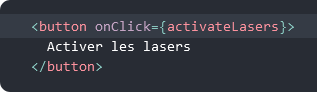
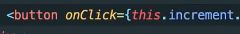
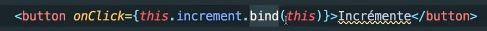
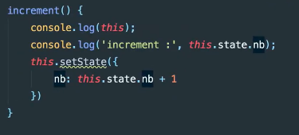
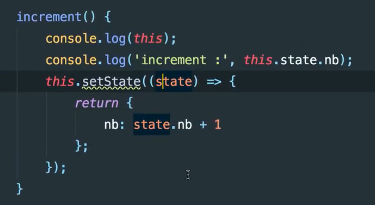
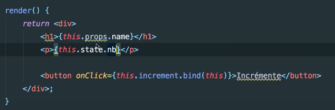
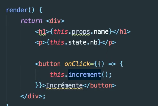

# **Gérer les évènements**

[Sommaire](./00-Sommaire.md)

Les événements de React sont nommés en camelCase plutôt qu’en minuscules.

En JSX on passe une fonction comme gestionnaire d’événements plutôt qu’une chaîne de caractères.

This.increment est un référence à la fonction increment().

il faut le lier avec la méthode bind().

Incrémenter le state.nb.

On peut aussi le faire avec une fonction fléchée.

Afficher le state.nb.

On peux aussi l'afficher avec une fonction fléchée.

Documentation.
https://fr.reactjs.org/docs/handling-events.html