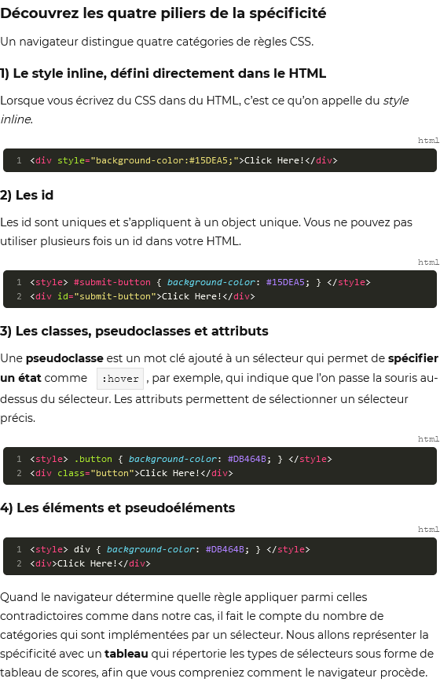
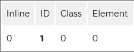

# Sructurez Votre CSS

[Sommaire](./00-Sommaire.md)

    Lorsque vous codez, pensez à adopter le DRY : 
    Don't repeat yourself !
    ne vous répétez pas !

    Lorsque vous créez des sélecteurs, faites attention à ne pas y entasser trop de règles. Séparer les sélecteurs par leur fonction vous aidera à garder votre code compréhensible et maintenable.

    La spécificité permet de mesurer le poids d’un sélecteur au sein du HTML parmi les autres.

    Il existe quatre niveaux de spécificité : 

        les feuilles de style locales (inline styles) ;

        les id ;

        les classes, pseudoclasses et attributs ;

        les éléments et pseudoéléments.

    Votre navigateur applique les éléments les plus spécifiques en premier.

    Le CSS n’a pas de structure rigide, ce qui complique la tâche pour avoir une codebase propre et maintenable.

    En créant et en appliquant votre propre structure, vous pouvez mettre de l’ordre dans un CSS brouillon...
